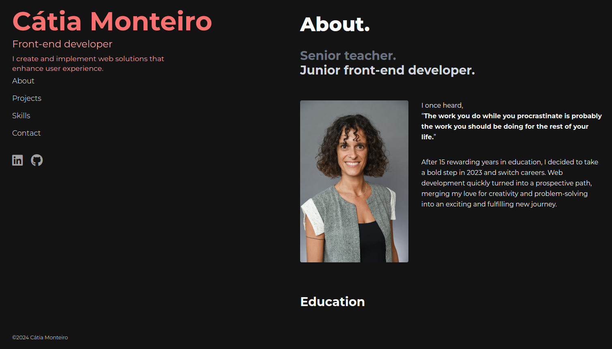

# **Cátia Monteiro** | Front-End Developer ✨ 

 

🚀  **Web Developer in the making & UI/UX Enthusiast**  
🌱  **Currently mastering:** HTML, CSS, JavaScript, and React  
💡  **Driven by:** Crafting creative and impactful solutions

---

### **Current Journey:**  
🧑‍💻  *Web Development Student at [DCI](https://start.digitalcareerinstitute.org)*  
🔧  *Building responsive web apps and exploring frameworks*  
🎯  *Refining design skills to elevate the user experience*

---
### **Let's Connect!**

[def2]: ./linkedin-icon.svg
[def2]: ./portfolio-preview.png
